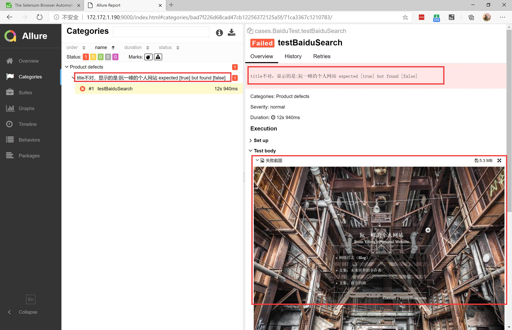

# Metis
> 名字取自希腊神话中的智慧女神墨提斯

## 技术栈
  - java
  - maven
  - selenium
  - testng
  - allure

## 特点
- 封装selenium对元素、浏览器的基本操作，使得用户编写脚本起来更简单上手
- 封装动作加入自动化的条件等待，使得编写出的脚本执行更高效，容错性更强
- 使用PageObject模式对页面元素和公共操作进行封装的最佳实践规范编写脚本，使得测试人员更方便的管理维护用例
- 支持全局运行失败用例重跑
- 集成Allure自动生成测试报告
- 使用TestNG的监听能力，监听测试过程，提供失败截图，获取用例操作步骤、期望结果接入报告中，使得测试人员回查测试更方便查错
- 集成Sikuli框架，便于编写图形脚本语言，基于图片进行的定位比对等功能
- 使用Testng便于灵活组织用例
- 支持运行时参数传递运行浏览器
- 命令式执行与入参便于持续集成与测试
- 支持在Jenkins中使用Selenium Grid插件进行分布式测试执行

TODO：
添加测试监听记录测试数据落DB

## 使用 
直接在本项目的 src/java/test/ 下编写测试脚本，也可以将本项目打包成jar包发布到私有仓库，供测试项目引用。

注意：
- 本仓库src/java/test/下为测试示例，打成jar包前可以删除，但是新建的引用jar包的测试工程也按照该示例结构进行编写。
- 需下载并设置符合你运行浏览器版本的 [webdriver](https://www.selenium.dev/documentation/en/webdriver/driver_requirements/) 放置与测试项目同级的webdrivers目录中。

### 目录结构
在 src/test/java/ 下编写你的测试脚本并维护通用的页面对象封装公共方法

在 src/test/resources/自动化测试用例.xlsx 中编写测试用例

在 src/test/resources/env.properties 中编写测试用例参数配置

在 src/test/resources/tesng.xml 中组织测试套件

## 执行命令
全部test执行：`mvn clean test -Dbrowser=chrome/firefox/edge..`

执行xml测试套件：`mvn clean test -Dsurefire.suiteXmlFiles=src/test/resources/testng.xml -Dbrowser=chrome/firefox/edge..`

执行某个测试类：`mvn clean test -Dtest=cases/BaiduTest -Dbrowser=chrome/firefox/edge..`

执行某个测试类中的一个方法：`mvn clean test -Dtest=cases/BaiduTest#testBaiduSearch -Dbrowser=chrome/firefox/edge..`

## 测试执行提效

在测试套件中加入 `parallel="tests" thread-count="5"` 进行并发执行测试

## 测试报告生成与查看

 

请先安装配置好allure工具，执行测试自动产生测试报告数据。

使用allure服务查看报告；

方式1 生成报告静态文件并打开index.html查看；
`allure generate ./allure-results/ -o ./reports/ --clean`

方式2 使用allure服务展示报告：
`allure serve ./allure-results/ --port 9000`

对于持续集成时不断更新并保留历史数据的报告应在CI中使用Allure CI插件生成

## iframe中页面元素的获取方式
https://www.selenium.dev/documentation/en/webdriver/browser_manipulation/#frames-and-iframes

## 登录认证的最佳实践
登录页面认证操作测试一次成功即可，保存此次获取的cookies，后面的操作需要认证的通过读取cookies进行认证，无需在脚本中进行登录的实际UI操作。

##  感谢 

https://github.com/Adien-galen/SelenJA 我是在此项目基础上修改而来的metis，表示感谢